Flashards
=========

Flashcards is the third graded project developed in the Udacity's React
Nanodegree.

Installation
------------

You need to install all the dependencies of the project before trying to run it:

    yarn install

If you use an Android emulator, make sure that the ADB verion in your path
marches the one used by the emulator.

Launching
---------

After installing the dependencies you can start the project:

    yarn start

Screenshots - Android
---------------------

Add a new card:

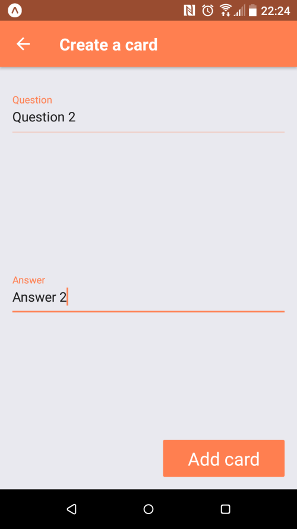

List of cards in a deck:

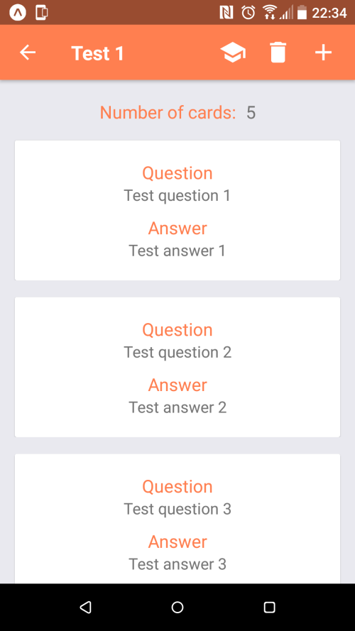

List of decks:

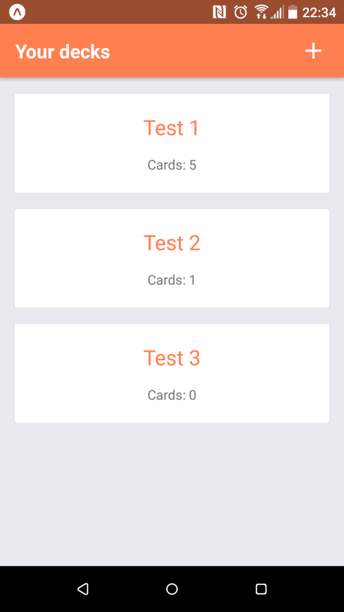

Select a number of questions in a quiz:

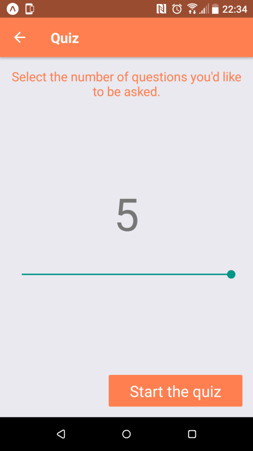

Quiz question:

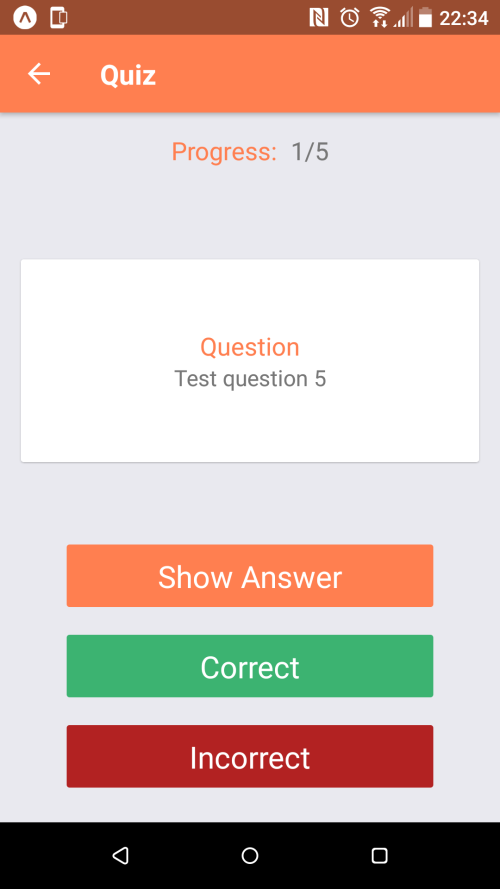

Quiz score:

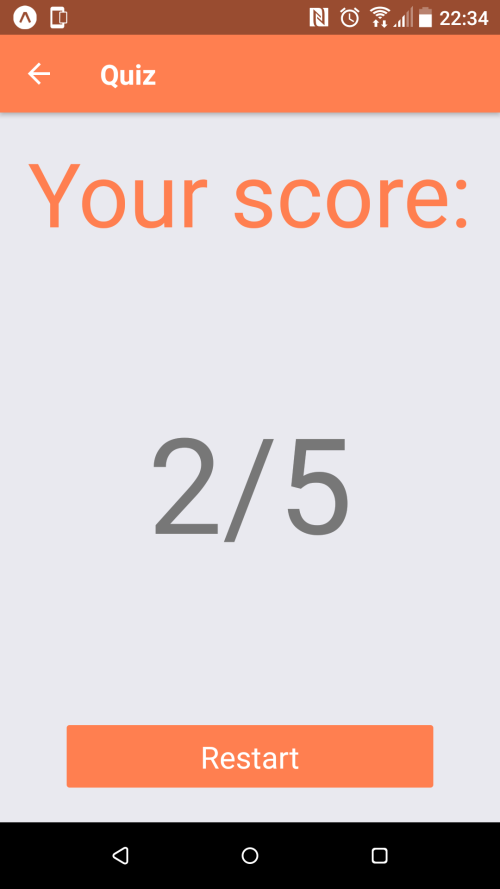

Screenshots - iPad
------------------

Add a new card:

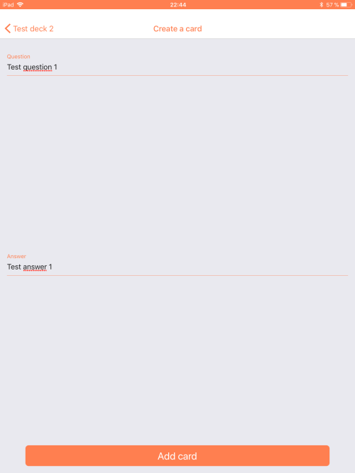

List of cards in a deck:

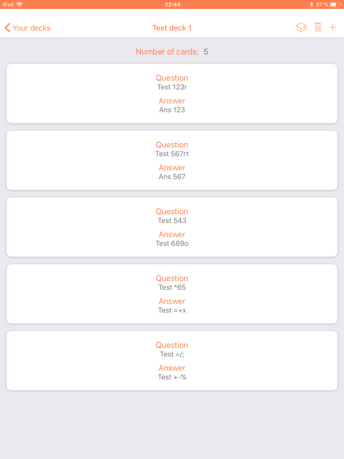

List of decks:

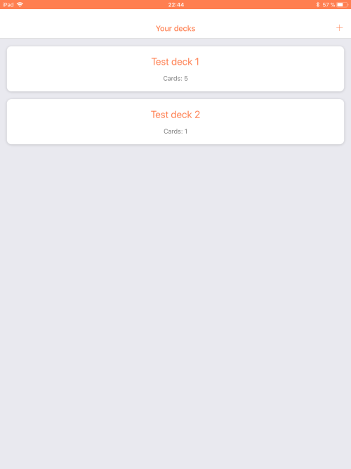

Select a number of questions in a quiz:

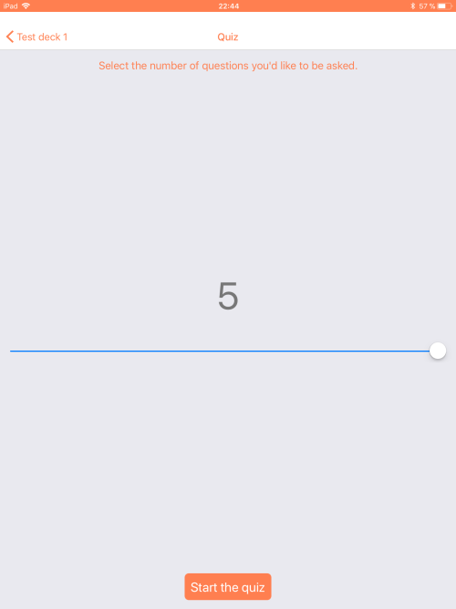

Quiz question:

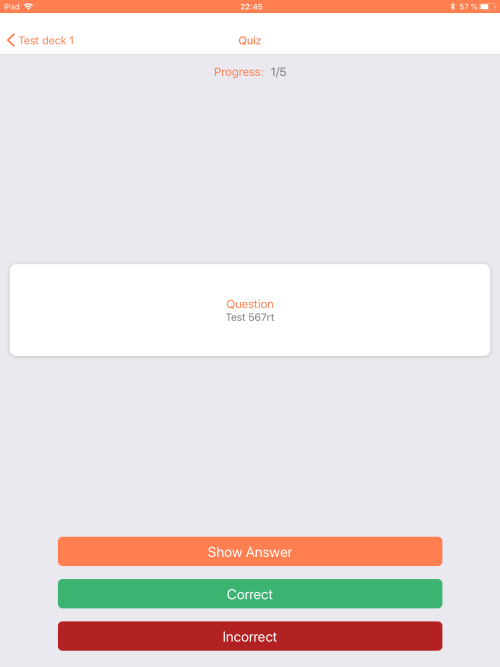

Quiz score:

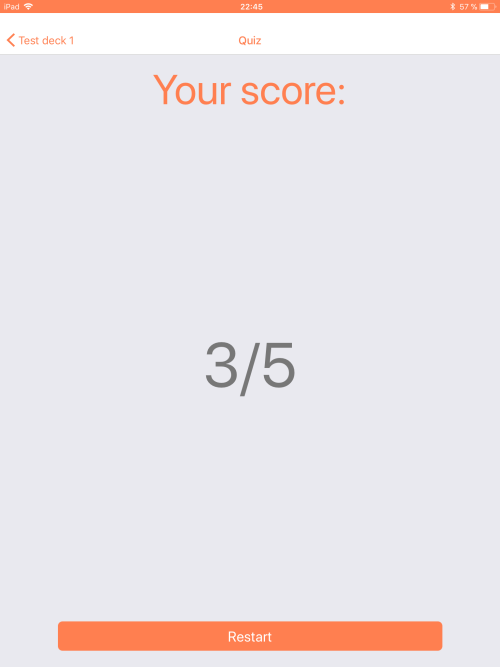
